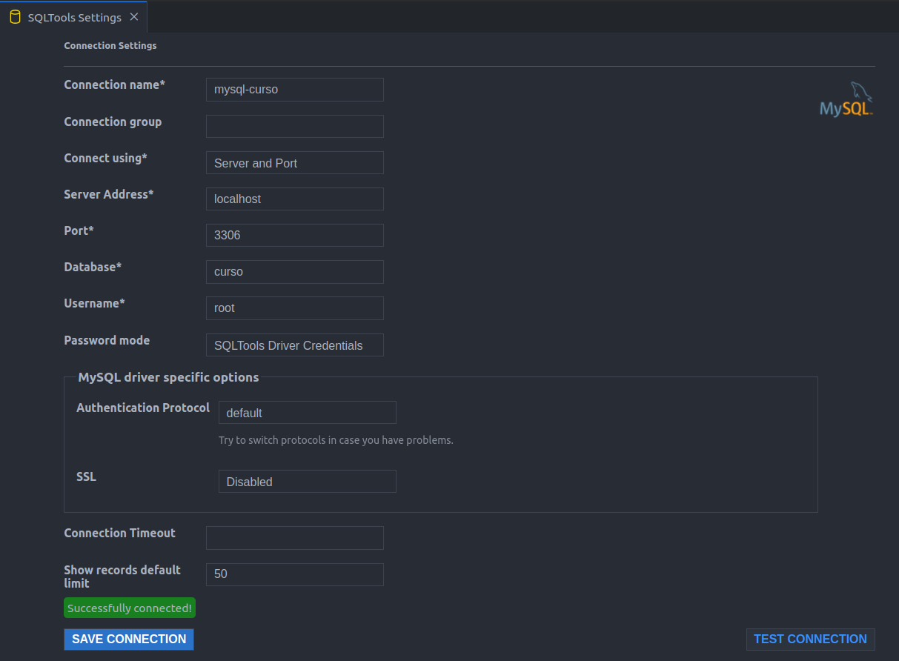

#### Instalar 

- Docker
- SQLTools Extension VScode 
- MySQL CLI

#### Subir MYSQL Container
docker run --name mysql-container -e MYSQL_ROOT_PASSWORD=senha123 -p 3306:3306 -d mysql:latest

#### Checar Container
docker ps

#### Acessar via CLI

mysql -h 127.0.0.1 -P 3306 -u root -p

#### Criar database

CREATE DATABASE curso;

#### Conectar MySQL -> VsCode
- Ctrl Shit P
- SQLTools:New Conn

- SQLTools: Connect 
    - abre uma session em um arquivo .sql 

- Seleciona query -> ctrl + shift + r para executar a query selecionada